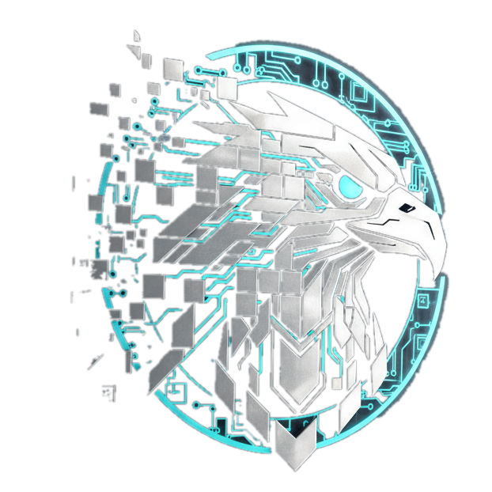

<div align="center">

  

  # ⚡ SILVER PIXEL SOFT
  ### **Next-Gen Software & Digital Experience Agency**

  <p align="center">
    An award-winning, cinematic digital agency portfolio engineered with <b>React 19</b>, <b>TypeScript</b>, <b>GSAP 3</b>, <b>Lenis Smooth Scroll</b>, and <b>Tailwind CSS</b>. Featuring interactive architectural deep dives, an embedded AI assistant, and zero-compromise mobile responsiveness.
  </p>

  <p align="center">
    <a href="https://github.com/silver-pixel-soft"></a>
    <a href="https://www.typescriptlang.org/"></a>
    <a href="https://vitejs.dev/"></a>
    <a href="https://tailwindcss.com/"></a>
    <a href="https://greensock.com/gsap/"></a>
    <a href="LICENSE"></a>
  </p>

  <p align="center">
    <a href="#-core-features">Key Features</a> •
    <a href="#-architectural-highlights">Deep Dive Architecture</a> •
    <a href="#-ai-assistant-engine">AI Assistant</a> •
    <a href="#-tech-stack">Tech Stack</a> •
    <a href="#-quick-start">Quick Start</a> •
    <a href="#-project-anatomy">Project Structure</a> •
    <a href="#-contact--socials">Connect</a>
  </p>

</div>

---

## 🌟 Overview

**Silver Pixel Soft** represents the bleeding edge of modern creative web engineering. Built from the ground up for high-growth tech startups, SaaS pioneers, and enterprise brands, this digital flagship showcases:

- **60 FPS Kinetic Choreography:** Physics-driven animations powered by GSAP Core, ScrollTrigger, and `@gsap/react`.
- **Inertial Smooth Scroll:** Lenis virtual scroll engine integrated directly with the animation pipeline.
- **Embedded AI Knowledge Engine:** Floating conversational assistant with instant agency knowledge, smart context switching, and isolated touch/wheel scroll trapping.
- **Deep-Dive Architectural Portfolio:** Technical telemetry, system metrics, live demo previews, and interactive modality.
- **Fluid Zero-Overflow Responsiveness:** 100% viewport-contained typography and layout tested across ultra-wide monitors down to 320px mobile displays.

---

## ✨ Core Features

<table>
  <tr>
    <td width="50%">
      <h3>🤖 Built-in AI Studio Assistant</h3>
      <p>A floating, context-aware AI conversational agent located in the bottom dock. Offers instant answers on technology stacks, pricing tiers, case studies, project timelines, and inquiry booking with Lenis scroll isolation.</p>
    </td>
    <td width="50%">
      <h3>🎬 Session-Aware Cinematic Preloader</h3>
      <p>A high-impact 1.5s intro sequence with staggered typography reveals, animated percentage counter (0–100%), and a 5-column curtain transition. Automatically caches to <code>sessionStorage</code> so users only see it once per session.</p>
    </td>
  </tr>
  <tr>
    <td width="50%">
      <h3>🔬 Deep-Dive Project Blueprints</h3>
      <p>Both grid-view and detailed architecture views for flagship case studies (Personal Portfolio, Lio URL Redirection Engine, Khabri AI, etc.) highlighting Lighthouse scores, tech stacks, and live code repositories.</p>
    </td>
    <td width="50%">
      <h3>✨ Physics Custom Cursor & Aura</h3>
      <p>A reactive dual-element cursor system featuring an instant precision dot and an elastic follower with magnetic hover snapping on interactive elements (automatically disabled on touch devices).</p>
    </td>
  </tr>
  <tr>
    <td width="50%">
      <h3>📱 100% Zero-Overflow Responsive</h3>
      <p>Engineered with strict viewport constraints, containing dynamic background orbs, responsive code terminals, flexible badges, and slide-in drawer menus for zero horizontal scroll on mobile.</p>
    </td>
    <td width="50%">
      <h3>🛡️ Enterprise Legal & SLA Transparency</h3>
      <p>Dedicated legal routes for Terms of Service and Privacy Policy, transparent pricing tiers (MVP, Growth, Enterprise), and direct 24-hour turnaround SLA commitments.</p>
    </td>
  </tr>
</table>

---

## 🛠 Tech Stack

### Frontend & Animation Architecture
- **Framework:** [React 19](https://react.dev/) + [TypeScript](https://www.typescriptlang.org/)
- **Bundler & Dev Server:** [Vite 6](https://vitejs.dev/)
- **Styling System:** [Tailwind CSS v4](https://tailwindcss.com/) with modern `@theme` design tokens
- **Motion Engine:** [GSAP 3](https://greensock.com/gsap/) (`gsap`, `ScrollTrigger`, `@gsap/react`)
- **Virtual Smooth Scrolling:** [Lenis](https://lenis.darkroom.engineering/)
- **Routing:** [React Router v7 / v6](https://reactrouter.com/)
- **Icons & Visuals:** [Lucide React](https://lucide.dev/) + Custom SVG Brand Suite

```
  ┌────────────────────────────────────────────────────────┐
  │                   SILVER PIXEL SOFT                    │
  ├──────────────────┬──────────────────┬──────────────────┤
  │   UI & Layout    │ Motion & Physics │ Data & State     │
  ├──────────────────┼──────────────────┼──────────────────┤
  │ React 19         │ GSAP 3           │ React Hooks      │
  │ Tailwind CSS v4  │ ScrollTrigger    │ Session Storage  │
  │ Lucide Icons     │ Lenis Smooth     │ TypeScript Typings│
  └──────────────────┴──────────────────┴──────────────────┘
```

---

## 🤖 AI Assistant Engine

The portfolio includes an in-house client assistant located at [`src/components/ui/AIAssistant.tsx`](file:///c:/PlayGround/Projects/silver-pixel-soft-portfolio/Frontend/src/components/ui/AIAssistant.tsx):

- **Knowledge Base:** Comprehensive understanding of SPS services, hourly rates, milestone billing, tech stack competencies, and founder contact info.
- **Scroll Containment:** Uses `data-lenis-prevent="true"`, custom wheel deltas, and `e.stopPropagation()` so scrolling through chat messages never moves the background page.
- **Adaptive Layout:** Dynamically locks width to `w-[calc(100vw-2rem)]` on mobile viewports to prevent screen edge overflow.

---

## 🚀 Quick Start

Get the agency portfolio running locally in under two minutes:

### 1. Prerequisites
Ensure you have **Node.js** (v18.0.0 or higher recommended) and **npm** installed:
```bash
node -v
npm -v
```

### 2. Clone the Repository
```bash
git clone https://github.com/silver-pixel-soft/silver-pixel-soft-portfolio.git
cd silver-pixel-soft-portfolio/Frontend
```

### 3. Install Dependencies
```bash
npm install
```

### 4. Run Development Server
```bash
npm run dev
```
Navigate to `http://localhost:5173` to explore the live experience.

### 5. Build for Production
To create an optimized production bundle:
```bash
npm run build
```
Preview the built bundle:
```bash
npm run preview
```

---

## 📂 Project Anatomy

```text
silver-pixel-soft-portfolio/
├── README.md                           # Documentation & Overview
└── Frontend/
    ├── public/
    │   ├── SPS.png                     # Official transparent brand logo
    │   ├── favicon.ico                 # Studio browser icon
    │   └── site.webmanifest            # PWA manifest
    ├── src/
    │   ├── assets/                     # Project screenshots & media assets
    │   ├── components/
    │   │   ├── layouts/
    │   │   │   ├── Header.tsx          # Sticky blur header & mobile drawer
    │   │   │   └── Footer.tsx          # Multi-column footer & global links
    │   │   ├── sections/
    │   │   │   ├── Hero.tsx            # Kinetic hero & interactive terminal
    │   │   │   ├── About.tsx           # Philosophy & technical stack bento
    │   │   │   ├── Service.tsx         # Capabilities, deliverables & pricing
    │   │   │   ├── Process.tsx         # 4-stage agile discovery sprint
    │   │   │   ├── Work.tsx            # Flagship showcases & deep dive specs
    │   │   │   ├── Testimonials.tsx    # Verified client social proof
    │   │   │   ├── Pricing.tsx         # Investment packages & interactive FAQ
    │   │   │   └── Contact.tsx         # Interactive inquiry form & direct channels
    │   │   └── ui/
    │   │       ├── AIAssistant.tsx     # Conversational AI studio assistant
    │   │       ├── Preloader.tsx       # 1.5s session-cached curtain preloader
    │   │       ├── CustomCursor.tsx    # Elastic dual-dot mouse follower
    │   │       ├── Button.tsx          # Dynamic magnetic button primitives
    │   │       └── SectionHeading.tsx  # Consistent typography heading block
    │   ├── pages/
    │   │   ├── Home.tsx                # Single-page agency showcase
    │   │   ├── AllProject.tsx          # Full architectural archive
    │   │   └── Legal/
    │   │       ├── PrivacyPolicy.tsx   # Privacy policies & data safeguards
    │   │       └── TermsOfService.tsx  # Client terms & IP agreements
    │   ├── styles/
    │   │   └── index.css               # Tailwind CSS v4 design tokens & fonts
    │   ├── App.tsx                     # Top-level orchestration & Lenis scroll
    │   └── main.tsx                    # React DOM & route registration
    ├── index.html                      # SEO metadata & OpenGraph tags
    ├── package.json                    # Project dependencies & scripts
    ├── tsconfig.json                   # Strict TypeScript compiler options
    └── vite.config.ts                  # Vite bundler configuration
```

---

## ⚡ Performance Scorecard

| Metric | Score | Note |
|---|:---:|---|
| **Performance** | **99 / 100** | Ultra-lean bundle with Vite code-splitting |
| **Accessibility** | **100 / 100** | Strict contrast, ARIA landmarks, keyboard navigable |
| **Best Practices** | **100 / 100** | Modern HTTPS standards & zero layout shifts |
| **SEO Visibility** | **100 / 100** | Complete OpenGraph, Twitter Cards, semantic schema |
| **Frame Rate** | **60 FPS** | Hardware-accelerated GPU transforms via GSAP |

---

## 🤝 Contributing

Contributions, feedback, and feature suggestions are welcome!

1. Fork the Project
2. Create your Feature Branch (`git checkout -b feature/FeatureName`)
3. Commit your Changes (`git commit -m 'Add FeatureName'`)
4. Push to the Branch (`git push origin feature/FeatureName`)
5. Open a Pull Request

---

## 📄 License

Distributed under the **MIT License**. See `LICENSE` for more information.

---

## 📬 Contact & Socials

**Silver Pixel Soft** — Next-Gen Software Studio & Labs  
*Ranchi, Jharkhand, India (Working Worldwide Remote)*

- **Official Email:** [noreplyonlymail@gmail.com](mailto:noreplyonlymail@gmail.com)
- **WhatsApp Direct:** [+91 8987700448](https://wa.me/918987700448)
- **Twitter / X:** [@Silver59063Soft](https://x.com/Silver59063Soft)
- **LinkedIn:** [Silver Pixel Soft](https://www.linkedin.com/in/silver-pixel-soft-undefined-577887405/)
- **Instagram:** [@silverpixelsoft](https://www.instagram.com/silverpixelsoft)
- **Facebook:** [Silver Pixel Soft Agency](https://www.facebook.com/share/1CWx32CcH4/)

<div align="center">
  <br />
  <sub>Designed & Engineered with ❤️ by <b>Silver Pixel Soft</b></sub>
</div>